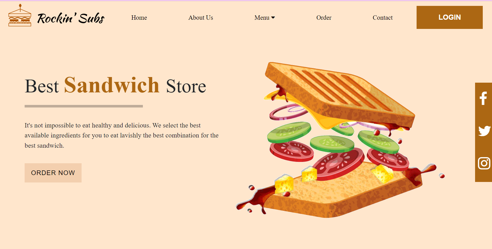

# ONLINE-FOOD-ORDERING-SYSTEM

#### An online food ordering system utilizing a combination of HTML, CSS, JavaScript, and PHP. This system enabled the establishment of restaurant or hotel menu's online and provided a seamless ordering experience for customers. Furthermore, it streamlined the maintenance of a customer database and substantially improved the efficiency of the food delivery service. This project has the potential to bridge the gap between technology and customer service in the food industry! 🍕🍔🥪🍴

The following are runtime GUI developed in the application along with functionality:

##### HOME PAGE

##### SIGNUP PAGE
